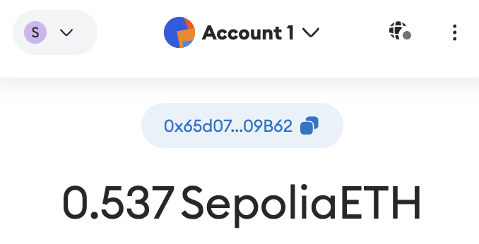
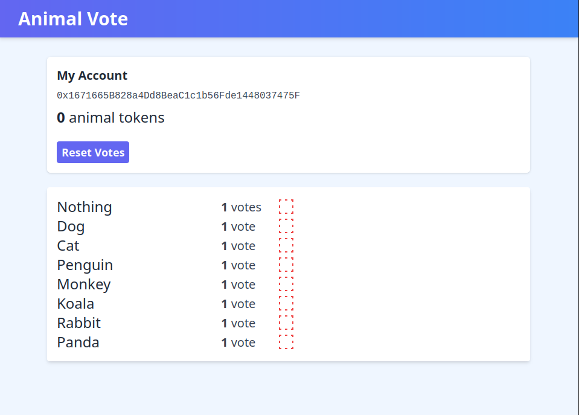

# DAO Homework

In this homework, you will learn about smart contracts. We have developed a
smart contract on Ethereum that contains a set of proposals which people can
cast votes for using the *quadratic voting* method.

The first part sets up the third part of this assignment by having
you create a Sepolia ETH address and submit it to a Google Form. 
The second part has you interact with a smart contract in a sandbox.
The third part involves the entire class where you will work with your 
classmates to make your favorite proposal win.

## Background on Quadratic Voting

In a quadratic voting system, each person is allocated a set of votes. 
They can then use them to vote for different proposals. 
If you vote for $N$ different
proposals once, you would spend $N$ votes. However, to vote $N$ times for
the same proposal, you would have to spend $N^2$ votes. This encourages you to spread
out your votes while making it difficult for a small group of people to make a single
proposal win.

In the course, you will be further exploring the concept of quadratic voting along
with other types of voting methods.
For now, you are going to get an intuitive appreciation of what quadratic voting
entails by completing this homework.

## Part 1: Setup for Part 3

This part sets up the third part of this assignment by having
you create a Sepolia ETH address and submit it to a Google Form.

### Installing MetaMask

The first step is installing [__MetaMask__](https://metamask.io/),
a browser extension that manages Ethereum wallets. MetaMask allows websites
to interact with its API to make (transaction) requests based on the actions
you take on the website.

After completing the MetaMask setup instructions, a wallet should be created.

### Getting some ETH

We will be giving you the tokens that you are going to use to vote on proposals,
but to be able to transact with the contract, you need *ether* - the currency on
the Ethereum blockchain. We will not be working on the Ethereum mainnet since
transactions would be costly, and instead work on an Ethereum
*testnet* called [__Sepolia__](https://sepolia.etherscan.io/).

A testnet is an alternative blockchain following the same protocols as the mainnet but
is to be used solely for testing purposes. Since the entire class will be working
on the same testnet, all transactions will be visible to everyone.

Since ether on a testnet has no value, instead of needing to mine ether,
or to buy it with real currency through an exchange, you can receive
ether for *free* using what is called a faucet - a mechanism that
distributes free ether.

There are several faucets you can use. We suggest that you use one of the following:

- [Faucet 1](https://sepoliafaucet.com)
- [Faucet 2](https://sepolia-faucet.pk910.de)
- [Faucet List](https://faucetlink.to/sepolia)

You will need to enter in your Ethereum wallet **public address** located in MetaMask
when on the *Sepolia* network.

(In case you do not see the Sepolia network, you will need to enable
test networks in Metamask under `Settings > Advanced`):

### Getting Animal Tokens

To vote on your favorite animal, you will need *animal tokens*.
We have set up a form for you to tell us your public address on the testnet
so that we may issue you animal tokens:

[Google Form](https://forms.gle/HirYypFFoD9Maxxj6)

You should use the *same* public address that you used in the previous
step for the faucets. This way, your wallet contains ether
to pay the transaction fees and animal tokens to cast votes 
on our deployed smart contract.

# Part 2: Solo Voting

In this second part (i.e., Solo Voting), you are going to work on your own to learn how to interact with Ethereum smart contracts. You will notice that you have to answer some questions at the end. You are going to submit a PDF document with your answers under this [Moodle assignment](https://moodle.epfl.ch/mod/assign/view.php?id=1183559). The instructions for this part can be found here:

[Solo Voting Handout](https://github.com/dedis/cs234-public/blob/main/DAO/handout/solidity_hw.md)

# Part 3: Interactive Voting

In this third part, you are going to work together with your classmates to beat the voting contract we have deployed on the SepoliaETH blockchain. Your goal (collectively) is to beat the proposal "Nothing" by making another animal win the poll :) In order to achieve this goal, you have to collaborate with each other to come up with a voting strategy. Therefore, it is crucial that you communicate with each other for this assignment.

Right now, the animal "Nothing" is winning, and you need to team
up if you want your favorite animal to win instead!

You will need to visit the website where the voting takes place:

[https://dedis.github.io/cs234-public/](https://dedis.github.io/cs234-public/)

You will need to give the website permission to use your Ethereum wallet through
MetaMask. Make sure you are connected to the *Sepolia* network since that is the
testnet where the contract has been deployed, and where you will be interacting with other students.

You will be given 9 animal tokens, and you can use those tokens to vote
on different proposals. The voting method is the same as in part 1: to get
a total of N votes for a single proposal, you need to spend a total of N^2 tokens.
You can vote for any proposal by clicking on the empty box beside it. 
You can also take back all of your votes at any point if you decide to change your mind.

___Keep in mind that interacting with the contract requires posting a transaction
on the blockchain, which may take up to 30 seconds or so. Therefore, you might
have to wait some time after you submit your transaction to see its effects.___

As you might have noticed, you will not be able to make your favorite proposal win
by yourself, instead, you will have to collaborate with the other students. Since there is
a single contract deployed on the testnet, all of the students are interacting with the
same state, so you can all influence the vote.

You have multiple options for communication channels: (1) you can discuss in person before/after the class (or during the break), (2) you can use the exercise sessions for CS-234 to meet in person, (3) if you do not feel comfortable with in-person meetings, you can use the Zoom link that we use for lectures during the exercise sessions to have online discussions, (4) you can use the Moodle forum for this homework, (5) you can do whatever else works for you.

Good luck!
